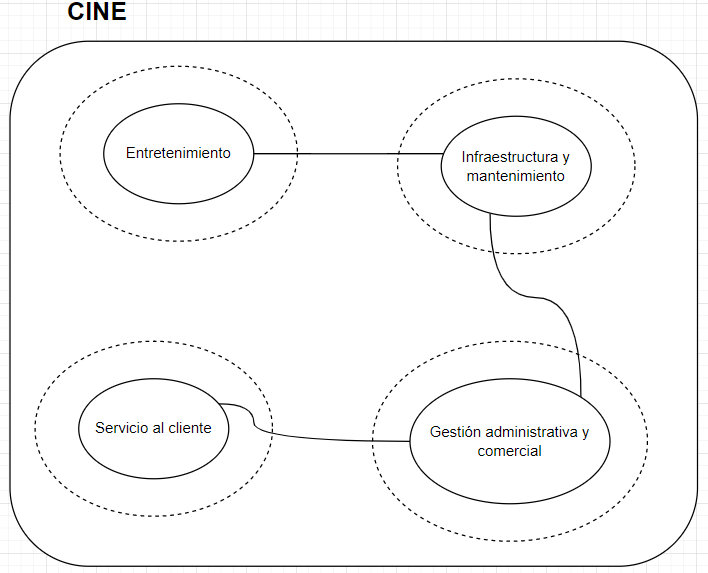
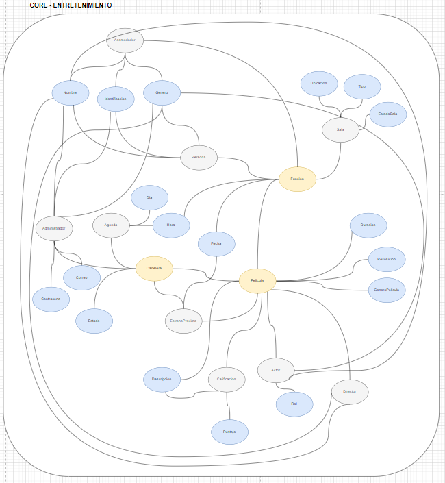
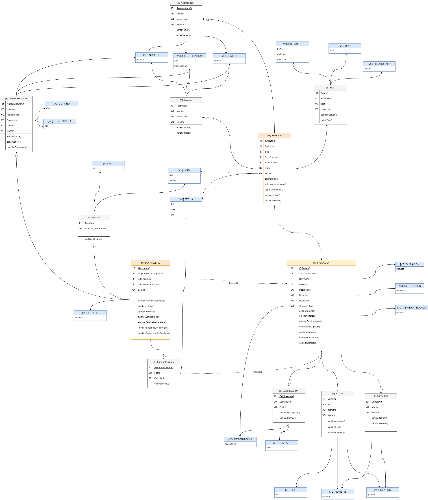
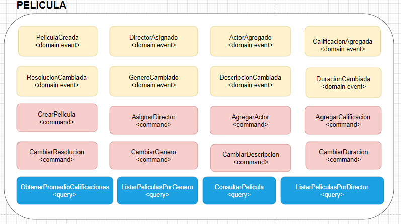
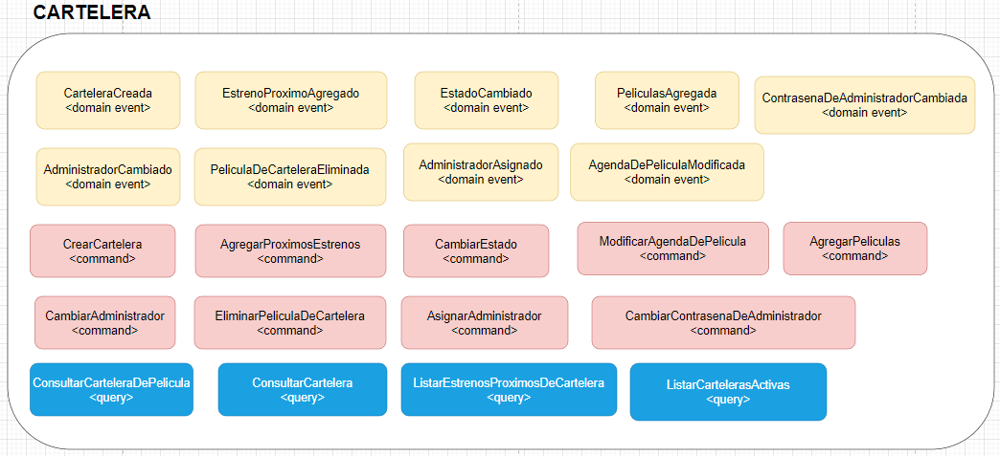
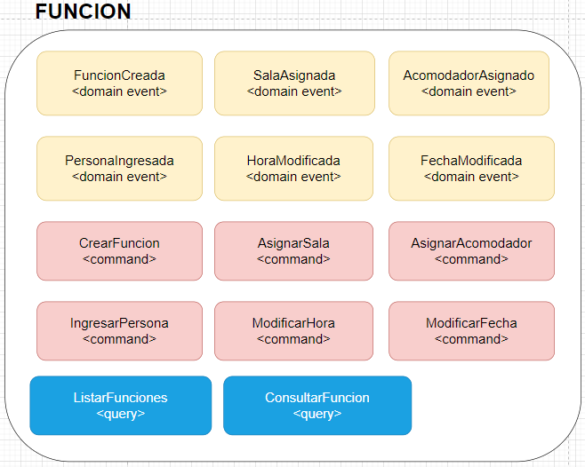

# Reto final

## ddd-cine

Proyecto basado en el contexto delimitado entretenimiento de un cine, se elaboró la parte estrategica y táctica de dicho dominio. Se implementaron casos de uso.

### Artefactos

<ul>
<li>Análisis del problema (big piture y contexto delimitado seleccionado). </li>
<li>Modelo de dominio, con los agregados, comportamientos, entidades y objetos de valor.</li>
<li>Implementación de casos de uso con sus respectivas pruebas unitarias</li>
</ul>

### Link del diagrama del dominio

https://drive.google.com/file/d/1yF0XpAvw1vvVl5hXv1zDZQcrsPjdSpi8/view?usp=sharing

## Análisis 

## Modelo de dominio

## Eventos

